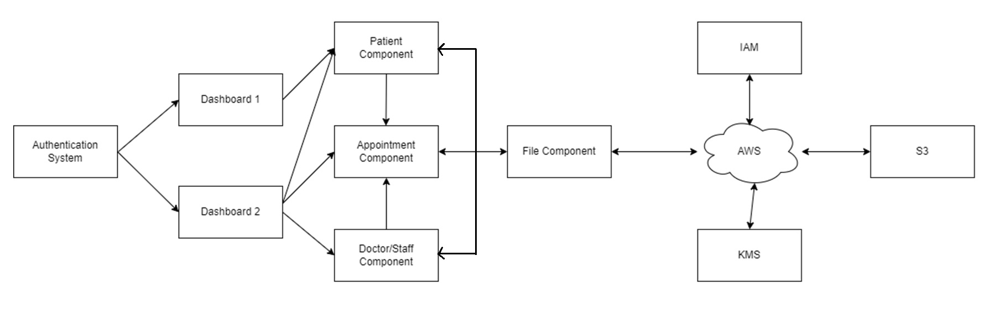
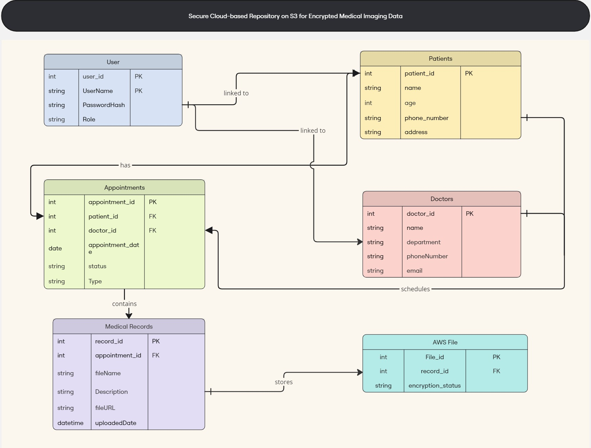
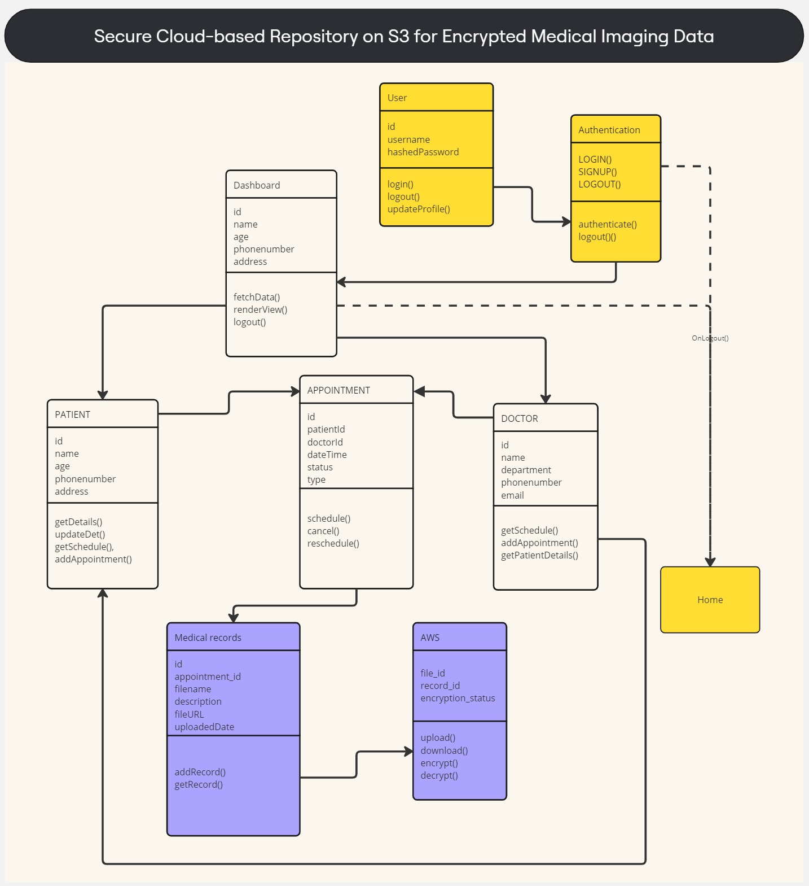
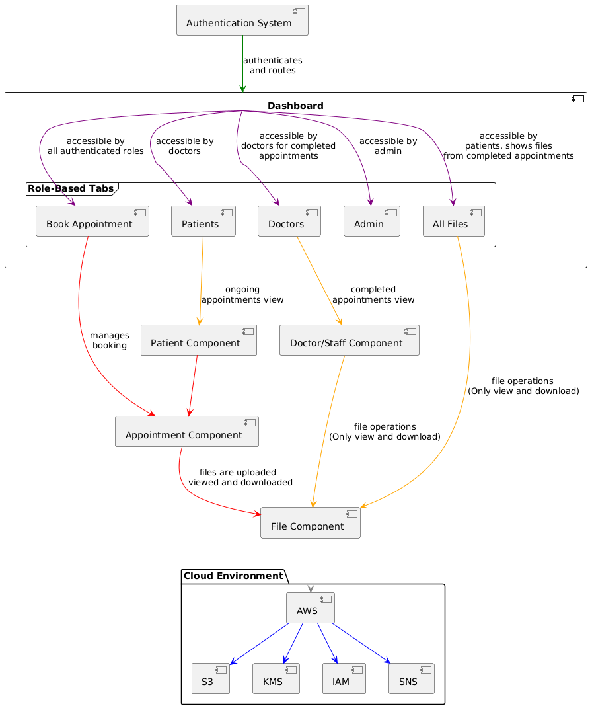
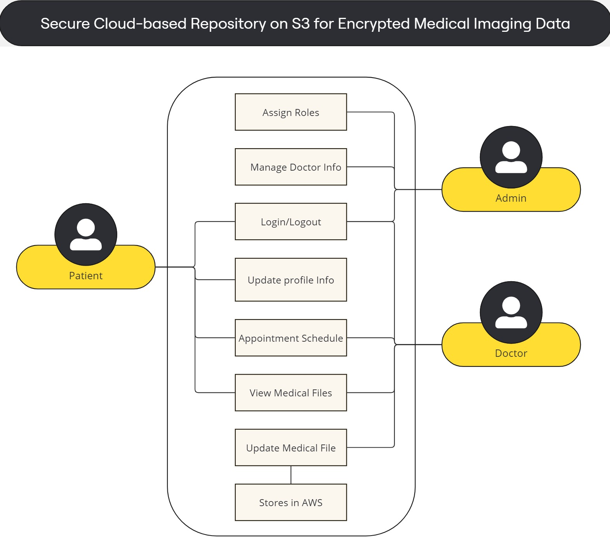
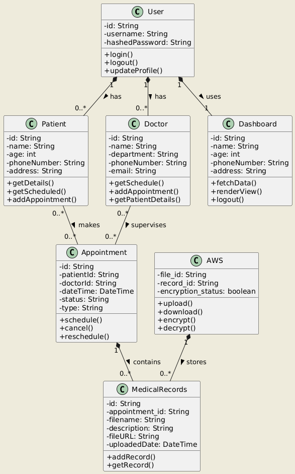
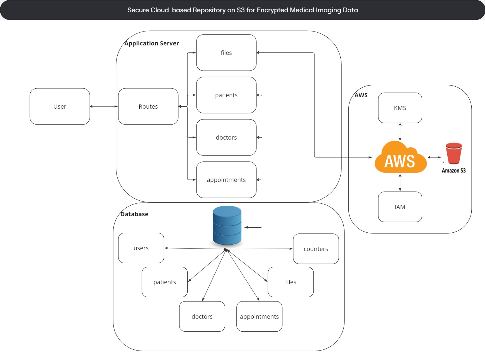

# Secure Cloud‑based Repository on S3 for Encrypted Medical Imaging Data

A **MERN + AWS** application for privacy‑preserving upload, storage, and retrieval of **medical imaging files**. 
Security is enforced with **AES encryption** (KMS‑managed keys), **SHA‑256 integrity** checks, **role‑based access control**, 
and **time‑bound signed URLs**. The system logs all sensitive actions for auditability.

> **Objective:** dependable, compliant handling of medical images across Admin, Doctor/Staff, and Patient roles.

---

## 📸 System Diagrams

### 1) High‑Level Component Diagram

*Shows the major client components (authentication, dashboards, patient/doctor/appointment/file modules) and how the app integrates with AWS services (S3, KMS, IAM, SNS).*

### 2) ER Diagram (Data Model)

*Entities and relationships for users, patients, doctors, appointments, medical records, and the AWS file/linkage.*

### 3) Module & Component Flow

*End‑to‑end navigation from authentication → dashboards → role‑specific tabs/components → file operations and AWS.*

### 4) System Design Flow

*How routes and feature modules interact with the database collections and AWS services.*

### 5) Use‑Case Diagram

*Role‑centric actions: login/logout, profile updates, appointments, viewing/uploading files, and admin/doctor capabilities.*

### 6) Class Diagram

*Core classes with attributes & methods (User, Patient, Doctor, Dashboard, Appointment, MedicalRecords, AWS).*

### 7) External Integration Diagram

*External services used by the system (AWS S3 for storage, KMS for encryption, IAM for permissions, SNS for notifications).*

> **Tip:** If you place images in a different folder, change the paths above. Recommended location is `docs/images/` inside the repo.

---

## ✨ Key Features

- **Encrypted storage** on S3 (at rest via KMS; in transit via TLS)
- **Integrity checks** using SHA‑256 hashes
- **RBAC** for Admin / Doctor‑Staff / Patient
- **Time‑bound signed URLs** for controlled downloads
- **Appointment management** (book/modify/cancel; role‑aware views)
- **Notifications** via AWS SNS/SQS (optional)
- **Audit logs** for sensitive actions (e.g., access/downloads)
- **Responsive React UI**

---

## 🧱 Architecture (at a glance)

- **Client (React):** protected routes and role‑aware pages  
- **Server (Node.js/Express):** JWT auth, RBAC, REST APIs, hashing, logging  
- **Database (MongoDB/Mongoose):** users, patients, doctors, appointments, files, counters  
- **AWS:** S3 (encrypted objects), KMS (data keys), IAM (least‑privilege), SNS/SQS (events)

**Core flows**  
- **Upload:** Authenticate → validate → encrypt & upload to S3 → save metadata (incl. `sha256`) → notify/log  
- **Retrieve:** Authenticate/RBAC → generate signed URL (TTL) → download → verify integrity → log

---

## 📁 Suggested Folder Structure

```
.
├─ client/        # React app (role-aware UI)
├─ server/        # Express APIs, auth, AWS integrations, logging
├─ docs/
│  └─ images/     # All README diagrams (this folder)
├─ README.md
└─ .gitignore     # plus client/.gitignore and server/.gitignore
```

---

## 🚀 Getting Started (Local Dev)

### 1) Prerequisites
- Node.js 14+ (LTS) and npm
- MongoDB instance
- AWS account with S3, KMS, IAM and (optionally) SNS/SQS

### 2) Install
```bash
# from repo root
cd server && npm install
cd ../client && npm install
```

### 3) Environment Variables
Create `server/.env`:

```ini
# Server
PORT=4000
NODE_ENV=development
JWT_SECRET=replace_me
JWT_EXPIRES_IN=1h

# Mongo
MONGO_URI=mongodb://localhost:27017/med-repo

# AWS (use least-privilege IAM or roles in prod)
AWS_REGION=ap-south-1
AWS_ACCESS_KEY_ID=...
AWS_SECRET_ACCESS_KEY=...
S3_BUCKET=your-secure-bucket
KMS_KEY_ID=your-kms-key-id
SNS_TOPIC_ARN=arn:aws:sns:ap-south-1:123456789012:appointments
```

### 4) Run
```bash
# terminal 1
cd server && npm start

# terminal 2
cd client && npm start
```

---

## 🔐 Security Model

- **RBAC:** role stored with user; backend routes & frontend components gated on role  
- **Auth:** JWT with sensible expiry (e.g., 1h)  
- **At rest:** AES with KMS‑managed data keys; S3 bucket encryption  
- **In transit:** HTTPS/TLS everywhere  
- **Integrity:** SHA‑256 stored with file metadata; verified on download  
- **Audit:** Application logs; recommend shipping to CloudWatch in production  
- **IAM:** minimal S3/KMS/SNS permissions scoped to this app/bucket/key

---

## 🛣️ Roadmap

- Stronger crypto patterns and key rotation
- EHR/EMR integrations via APIs
- De‑identified analytics & reports
- Mobile client
- Autoscaling & S3 lifecycle tiers for cost controls

---

## 📜 License

MIT (or update to your preferred license)
